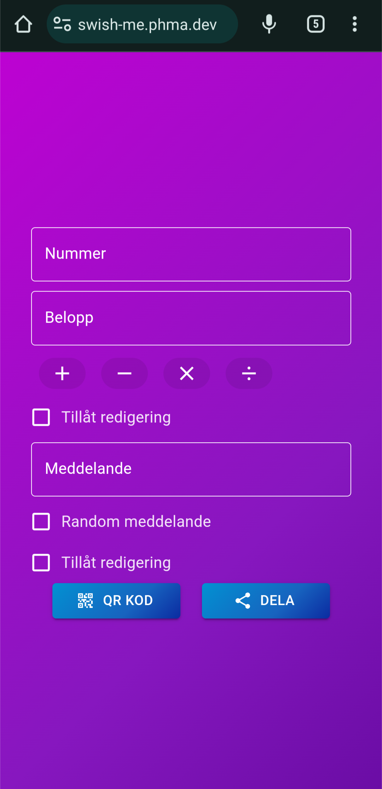
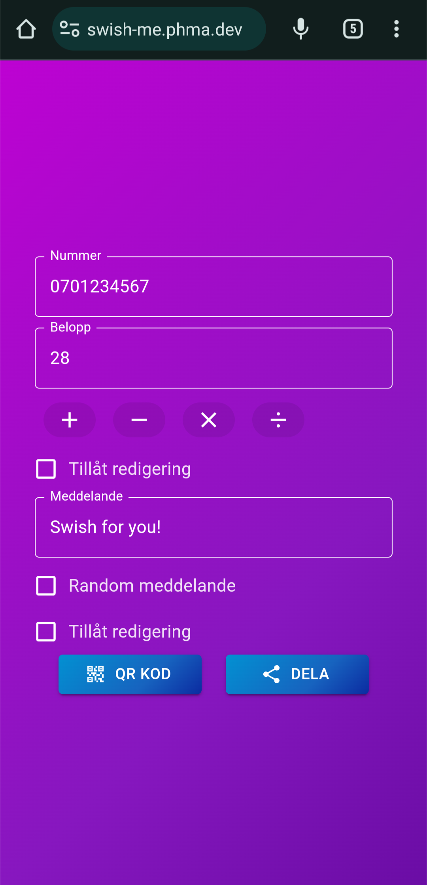
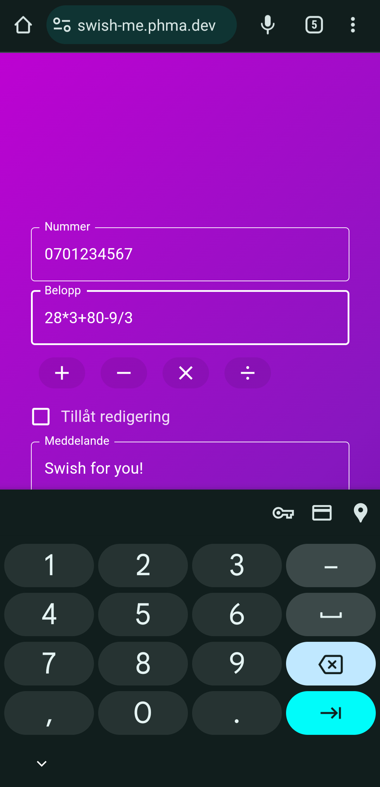
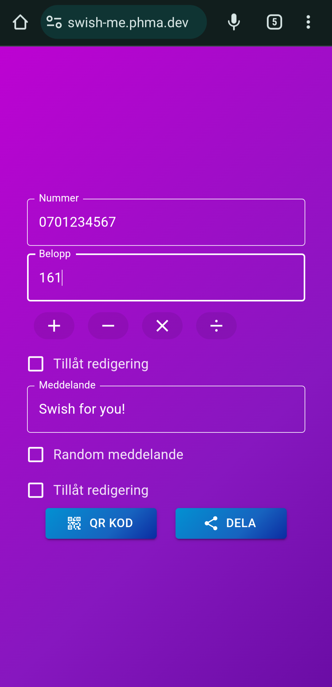
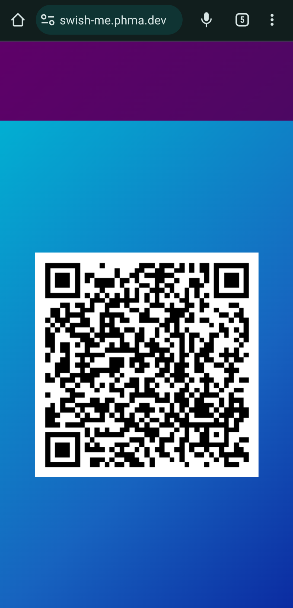
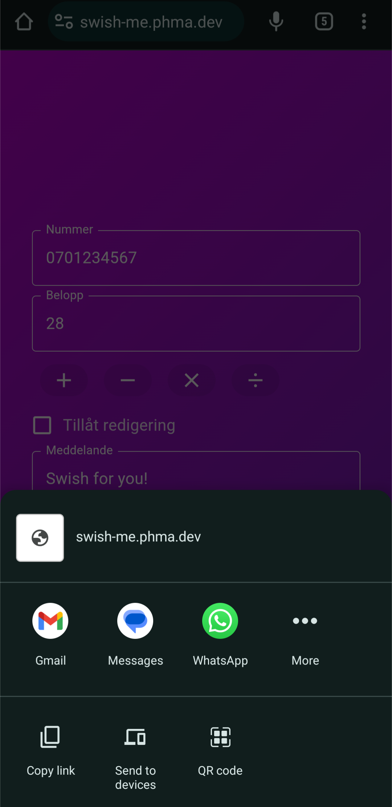
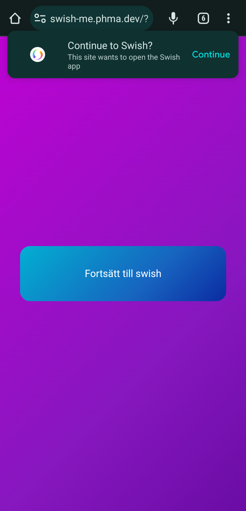

# [swish-me](https://swish-me.phma.dev)
Create and share swish link to make swishing easier!

# Developing, new pictures and more on the way!

#
[Swish](https://swish.nu) is an app in Sweden to send and recive money, much like paypal. The app is nice to use and has some good features, one of them is their QR codes, using them you can also create links. Because of limitations of how many swish requests you can send, and because people sometimes don't have notifications or for some reason don't open their swish, this application was born. 

The application itself is not the most elegent but it works, I have not yet been able to find a way to change the card attached but if I do the application will be updated. The random messages are some funny stuff me and my friends came up with while drunk and are not meant with any harm or malice. 

By defualt all values are locked but you can unlock them by checking the "Allow edits" button, only the message and amount are able to be unlocked, the number is not. 

The amount field includes a calculator just like the swish app to make it as convenient for you as possible. 

#

Input your number, amount and a message, if you feel like it. Your number is saved in localstorage (cookie) so you don't have to type your number every time!
 

  
Handy calculator
 

  
Share via QR-code or your phones share tool
 

  
When you open the link you are greeted by this page where you can easily open swish!
 

# To-dos
Ideas for the future

- Create account and save numbers
- Being able to send links to multiple people
  - mail, phone, discord etc.
- Scan a receipt

#
Philip Magyar  
Version: 1.0.0